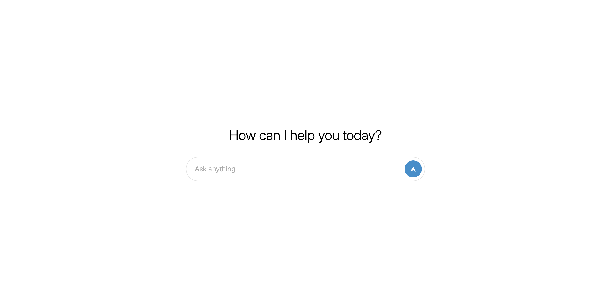

# chat-ui

[Vite](https://vitejs.dev/) | [React](https://react.dev/) | [Redux Toolkit](https://redux-toolkit.js.org/)



```
chat-ui/
├── src/
│   ├── assets/
│       └── fonts/
│   ├── features/
│   ├── App.jsx
│   ├── index.css
│   ├── main.jsx
│   └── store.jsx
├── package.json
├── vite.config.js
└── README.md
```

## Requirements
1. Node.js

## Installation
```
git clone https://github.com/sylogea/chat-ui.git
cd chat-ui
npm install
```

## Development
```
npm run dev
```
